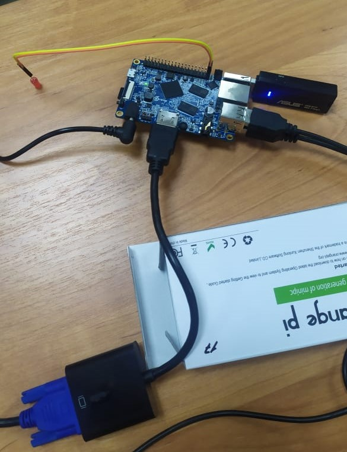

 # IOTProject

# Цель:

      Цель работы - научиться работать с микрокомпьютером и разработать систему управления объектами.
      
# Задача:
      
      Задача состоит в том, чтобы управлять микрокомпьютером и включать и выключать лампу.
# Что мы хотели сделать?
      
      В начале мы подключаем все необходимые соединения, такие как мышь, клавиатура, экран, 
      и подключаем диод к компьютеру, используя два соединения в порт 39 и 40.
      
      как показано на рисунке, и не перепутать +/-.

      Затем входим в систему через команду.
      sudo -i
      Затем ставим пароль
      "orangepi"
      Затем создаем рабочий порт через команду.
      
      echo 199 > /sys/class/gpio/export  // Это создаст экземпляр GPIO199.
      echo out > /sys/class/gpio/gpio199/direction // Это установит GPIO199 как ВЫХОД.
      
# Что в итоге получилось?
      В конце концов, мы можем управлять освещением лампы или выключать ее через эти команды.
      
      // Это установит GPIO199 HIGH.
      echo 1 > /sys/class/gpio/gpio199/value
      
      // Это установит низкий уровень GPIO199.
      echo 0 > /sys/class/gpio/gpio199/value  
      
Автора : Эскарус Бешой Паулс Рушди  
Группа : РИС 20-1Б  
ИМЯ : Бешой  
Предмет : Интернет Вещей 
